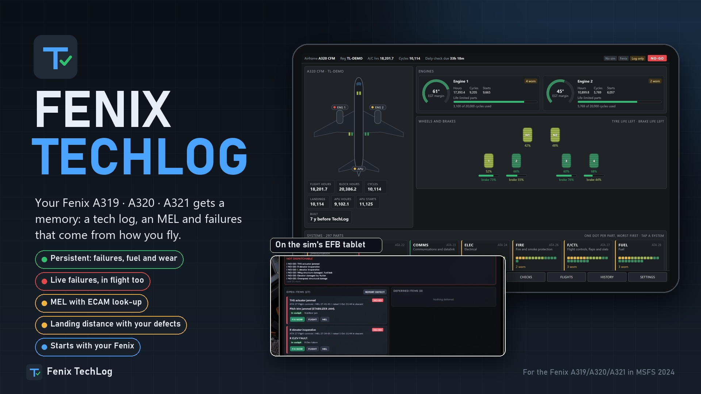
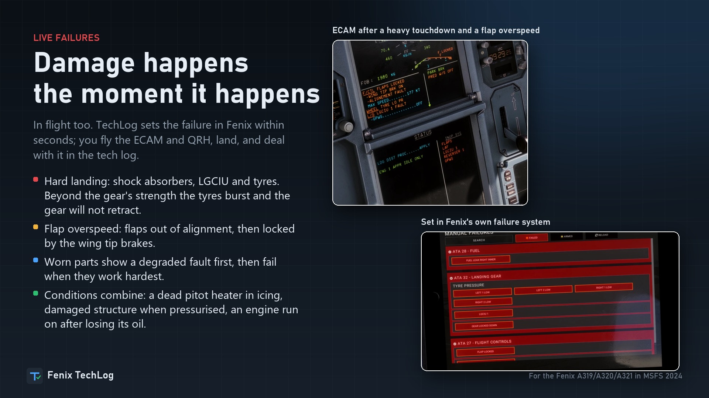
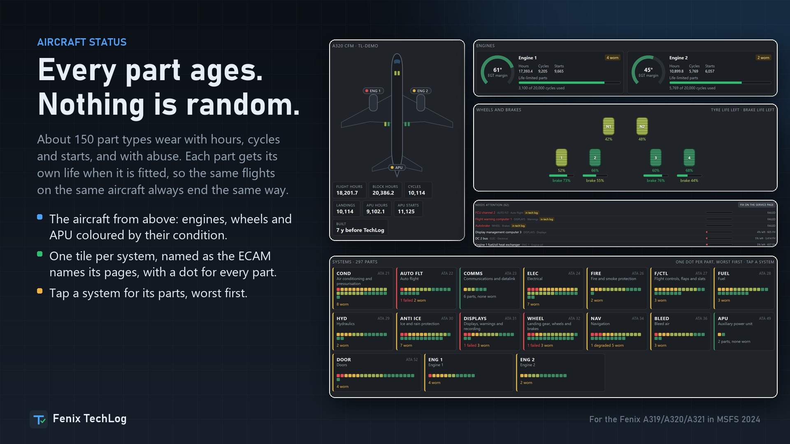

# Fenix TechLog

**A persistent tech log, MEL and live failures for the Fenix A319 / A320 / A321 in Microsoft Flight Simulator 2024.** Free.

Every time you load the Fenix it is a brand-new aircraft. Fenix TechLog gives each airframe a memory: wear, defects, fuel, fluids and the cockpit itself carry on from one session to the next. Parts fail from how you fly, the failure is set in the Fenix within seconds, and you fix or defer it under an MEL on the EFB tablet.

## Download

**[Get the latest version](https://github.com/ersindevrim/FenixTechLog-releases/releases/latest)**: download `FenixTechLog-Setup-vX.Y.Z.exe` and run it with the simulator closed.

Also on [flightsim.to](https://flightsim.to/addon/116154).

## What it does

- **Persistent aircraft.** Open and deferred defects are set in the Fenix again every session. Fuel, oil, oxygen, tyre pressures, brake and tyre wear, hours and cycles carry on. The cockpit goes back to how you left it, switch by switch.
- **Failures with a cause, not dice.** About 150 part types each have their own life. Worn parts show a fault first, then fail when they work hardest.
- **Damage the moment it happens.** Hard landings, flap and gear overspeeds, tail strikes, hot brakes, takeoff thrust held too long.
- **A worn aircraft does not fly like a new one.** Worn engines really push less, so fuel flow and EGT go up. Seals seep, brakes fade, starts fail.
- **Tech log with an MEL.** 220 items. NO-GO grounds the aircraft; the rest you fix, or defer to a real date.
- **Every flight recorded.** Touchdown, approach stability, a timeline and a score.

## You need

- Windows 10 or 11 (64-bit)
- Microsoft Flight Simulator 2024
- The Fenix A319 / A320 / A321, with its EFB working

## Install

1. Download the setup from the [latest release](https://github.com/ersindevrim/FenixTechLog-releases/releases/latest) and run it.
2. If Windows SmartScreen appears, choose **More info**, then **Run anyway**. The installer is not code-signed.
3. Check the two folders the setup shows: your Community folder and the Fenix's own folder.
4. Start the simulator, load a Fenix, and open **Fenix TechLog** on the EFB tablet.

## Updating

From version 0.4.0, TechLog tells you when a new version is out and can install it itself. To do that it reads the file `latest.json` from this page each time it starts. Nothing about you or your aircraft is sent, and it can be switched off in TechLog's settings.

## Bugs and ideas

Open an [issue](https://github.com/ersindevrim/FenixTechLog-releases/issues) here, or comment on the flightsim.to page. A line from the TechLog window or a screenshot helps a lot.

## Licence

Fenix TechLog is closed-source freeware: see [LICENSE.txt](LICENSE.txt). Please link to this page rather than re-uploading the file.

The MEL text is TechLog's own, written for simulation. Never use it for a real aircraft.

Not affiliated with Fenix Simulations or Microsoft.
